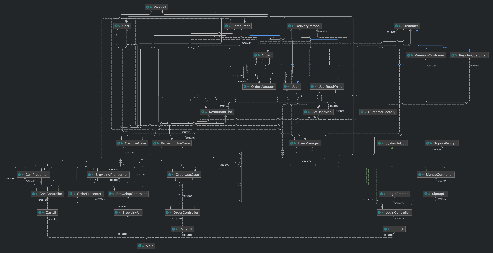

# Design Document

## SOLID

### Single responsibility principle
Each of our Controller classes has its own UseCase class. In this way, it guarantees that each module is responsible 
for one business function.

### Open/closed principle
Our User abstract class and SystemInOut interface demonstrate that our project follows the open/closed principle. 
For example, more user types can be added by extending the User abstract class. Each Controller class implements the 
SystemInOut interface which is our input-output boundary, future new Controller classes can be associated with 
SystemInOut by implementing it can overwrite the methods in the SystenInOut interface.

### Liskov substitution principle
Our child classes of User only extend and add behaviour to User. They do not modify Users. This indicates that our 
code follows the Liskov substitution principle.

### Interface segregation principle
Our SystemInOut interface is small and only contains `getInput()` and `sendOutput()` which are needed by every 
Controller classes. This, our code follows the interface segregation principle.

### Dependency inversion principle
Our code does not follow the dependency inversion principle that we do not have any abstraction layer between 
low-level classes and high-level classes.

## Clean Architecture

### UML diagram

### Scenario walk-through
Here is a scenario walk-through of how a customer will place an order. When the customer runs the program, a 
`LoginUI` will be created which then creates the `LoginController`. The `LoginController` will initiate its 
presenter, `LoginPrompt`,  and its use case, `UserManager` to verify the user. If the user has never used FeedMe 
before, Typing “S” or ‘s’ would direct the user to the signup phase. Signup would take all the required information 
to create a user by using “UserManager”. After the Signup process is finished, the user will be brought back to log 
in again. Using the phone number and password to log in to the program we would identify the user type by their 
phone recorded in the database and bring up the different UI for different types of users.

After the customer has successfully logged in. The `BrowsingUI` will be initiated, which then creates its controller 
class, `BrowsingController`. In `BrowsingController`, the use case (`BrowsingUseCase`) and presenter 
(`BrowsingPresenter`) will be made. `BrowsingController` also implements the `SystemInOut` interface which is the 
input-output boundary that is responsible for getting the user’s input and sending output to the user. First, the 
`BrowsingController` will call the `showRestaurantList()` in `BrowsingPresenter` to show the list of restaurants and 
ask the customer to select the restaurant that they are interested in. Once the customer made a selection, then the 
`BrowsingController` will check the validity of the input and show the menu of this restaurant by calling the 
`showMenu()` method in `BrowsingPresenter`. Next, the customer will be asked to select that if they would like to 
order from this restaurant. If the customer confirmed that they would like to this restaurant, the phone number of 
this restaurant (`restaurantNum`) will be returned as a String to `BrowsingUI` which will then be returned to `main`.

Next, the `CartUI` will be initiated and the `restaurantNum` will be passed to `CartUI`, `CartController`, and 
`CartUseCase`. First, the `CartController` will display the restaurant menu by calling the `showRestaurantName()` 
method in `CartPresenter`. Then, the customer will be asked to select the product that they would like to order. 
After checking the validity of the input, the customer will be asked to enter the quantity of product that they want 
to order. If there is enough stock, then the customer will be asked that if they would like to submit the order, 
otherwise `noStock()` method will be called from the `CartPresenter` to tell the customer that there isn’t enough 
stock. The product name and the quantity will be stored in a Map called `cart`. If the customer decided to submit 
the order, the `cart` will be returned to the `CartUI` and to the `main`.

Then, the `OrderUI` will be initiated and the `customerNum`, `restaurantNum`, and `cart` will be passed to `OrderUI` 
and to `OrderController` and `OrderUseCase`. The order will be created in `OrderUseCase` and the success message in 
`OrderPresenter` will be called by `OrderController` which shows tells the customer that the order has been 
successfully made and the order id of the order.

This scenario walk-through demonstrates that our code follows clean architecture because our codes go from low-level 
to high-level. We only call Entities in the UseCases rather than Controller, Presenter, or UserInterface. In our 
example, we need the information of the customer, restaurant, and cart. However, we did not pass the entities around 
the controller or UserInterface. Instead, we pass the string that contains the information we need to find the 
entity, and then we create a method in the UseCase to find the entities using this string.

### Refactoring
(Pull request #27: https://github.com/CSC207-UofT/course-project-feedme/pull/27) Our previous design about 
`SystemInOut` violates the open-closed principle because SystemInOut 
was implementing every Controller class. Therefore, we refactored the code to invert the implementation that every Controller class is now implementing the SystemInOut.

