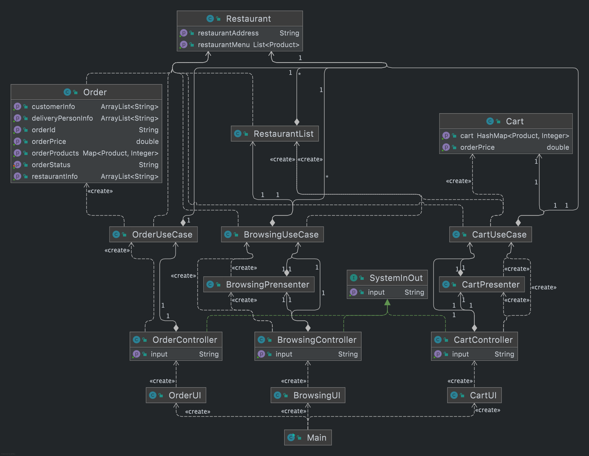

# Progress Report
## Jing Liu

My work in Phase 2 involved in two main parts:
1. Refactoring
   - I refactored `SystemInOut`. It used to be controller classes implementing `SystemInOut`, which violates the 
     open-closed principle. To fix this issue, I invert the implementation, so every controller class is now 
     implementing the `SystemInOut`.
   - Create `Presenter` class for each part of the order system which includes `BrowsingPresenter`, `CartPresenter`, 
     `OrderPresenter`. We used to have all the output prompts in the controller class which does not follow clean 
     architecture. To avoid this, we extract these prompts to presenter class.
   - Rename `OrderUseCase` to `CartUseCase` to avoid repetitive naming.
2. Complete last part of order system
   - I finished the last part of the order system, which includes `OrderUI`, `OrderController`, `OrderUseCase`, 
     `OrderPresenter`. This enables customers to create an order, and this order will be added to customer's and 
     restaurant's order history.
   - Completed all the JavaDoc for codes that I wrote.
   - Fixed some toString formatting issues.
   - Made change to main, so that `BrowsingUI` will only be initiated if the login user is a `Customer`.
- In addition, I participated in the discussion about how to store and access our files with Allen and Edward.
- I also discussed how to refactor our code to follow clean architecture with Ellen and Edward.
- I wrote the design document and made edits to accessibility report.
- Pull request #31 https://github.com/CSC207-UofT/course-project-feedme/pull/31

## Edward Wan
1. Refactored All three types of user’s Reader/Writer (six classes) into one `UserReadWrite` class (and move them to 
   the gateway folder).
2. Implemented `GetUserMap` such that using `UserReadWrite` would not require a large number of changes on code since 
   `UserManager` uses Map in advance.
3. Added the presenter class for the Signup/Login controller, changing the dialogue from those classes would not 
   change code from the controller anymore.
4. Redesigned both controllers, added prevent repeated phone numbers at signup states, and 5 unsuccessful attempts 
   would break the program (raised null pointer exception right now since it will return null).
5. Achieved serialization on all required files (all types of `User`, `Product` and `Order`). Take care of any 
   error/exception raised by serialized classes when teammates need to use them too(lots of troubles happened here). 
   Such as adding `Order` to `orderHistory`.
6. Completed the Login/Signup stages from phase 1.
Added docstring.
7. Refactored the `createUser` method in `UserManager` that the `SignupController` would interact with entities 
   anymore, instead, it would put inputs into the method and do everything in `UserManager`.
- pull request #31 (https://github.com/CSC207-UofT/course-project-feedme/pull/31)

## Huiru Tan

In phase 2, I completed the Delivery System, including the following classes/interfaces/tests:
- Build new files:
  - `DeliverUI`
  - `DeliverController`
  - `DeliverManager`
  - `DeliverControllerTest`

- Update files:
  - `Main`
  - `OrderManager`
  - `OrderManagerTest`

- In `DeliverController`, I implement some methods. 
  1. First, `getallundeliveredorders`, it is aimed to return a list of 
  undeliveredorders. By reaching this, it needs to access the usecase `OrderManager` and the entity `Order`, to check 
    if the orders have been assigned a deliveryperson. 
  2. Second, `updateOrderdeliveryperson`, it is used to update the 
    deliveryperson id in an order if it has been chosed to deliver.
  3. Lastly, `showDeliverPortal`, it is for the user 
    Delivery person to see what orders still needs to deliver, and update order information if they have chosen to 
    deliver something. In `DeliverUI`, it is a user interface for Deliveryperson to see the deliver portal. It needs to 
    access the `DeliverController`.

## Lulu Cheng

Update:
products
restaurant

complete:
restaurantManager
restaurantSystemPresenter
menuList
restaurantManagerTest

In phase2, I continued to work with Francis to complete the construction of the interface for the restaurant owner. Firstly, to better meet the requirements of clean architecture, I added the restaurant SystemPresenter section. The main role of the Presenter here is to call the controller to be better used by the use case output port. The presenter, who is on the same level as the controller, exists to display what the user input will show after the program is executed internally, thus making it easier to operate the UI.
In addition, due to some changes in the underlying logic that overlap within the group, we have also made significant adjustments to the framework for each of the relevant restaurant system controllers. Finally, I added a controller test case for each method to verify that it makes sense.

https://github.com/CSC207-UofT/course-project-feedme/pull/33

## Bowen Liang
Updated:
products
restaurant

complete:
restaurantSystemController
restaurantUI
restaurantManager

In our subgroup, we have refined the construction of the restaurant SystemController, which was not implemented in phase1. The following is a rough flow of how the restaurantSystemController implements its functionality.

This is the “restaurant system controller”, which is used by the owner of the restaurant. When the restaurant owner runs the program, a “restaurant UI” is created, followed by the “restaurant controller”, which uses the closely linked “restaurantManager “. In addition, to keep the UI simple, we have the “restaurantSystemPresenter” which contains most of the output. The “restaurant manager” will continue to use the ‘restaurant’ and ‘product’ at the bottom level. After a series of user registration and login procedures as described above, the restaurant owner is faced with three options, namely “editMenu”, “orderHistory” and “ receiveOrders”. Once the restaurant owner has selected “editMenu”, the restaurant system controller will check if the product id entered already exists. If it already exists, the controller will continue to give three options, namely, to change the product name, to change the product stock and to change the product price. The restaurant owner simply enters the keywords 1, 2 or 3 as per the question to complete the operation. If the product does not already exist, the controller will automatically build a new product for the restaurant owner by asking for the name, price, and stock of the new product. The second option, “orderHistory”, shows the history of orders that have existed. The third option “receiveOrders” is used to receive new orders. It is worth noting that the restaurant owner can return to the previous level by typing QUIT, regardless of the level reached. This design takes universal design into account and can be used to minimise errors.
We also added the restaurantUI and updated the main section in order to allow the controller and presenter to be presented.

https://github.com/CSC207-UofT/course-project-feedme/pull/32

